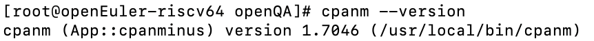

# cpanm缺失解决

## 问题说明

当您遇到这个问题时，说明您的系统中没有安装 `cpanm` 工具。

## 解决办法

请您使用以下指令安装`cpanm` 工具：

```
sudo yum install perl-App-cpanminus
```

### 您可能遇到的情况

```
[root@openEuler-riscv64 openQA]# sudo yum install perl-App-cpanminus
Last metadata expiration check: 0:30:37 ago on Tue Feb 14 15:32:20 2023.
No match for argument: perl-App-cpanminus
Error: Unable to find a match: perl-App-cpanminus
```

以上问题说明目前 openeuler 中不存在 perl-App-cpanminus 的包，建议您可以从 CPAN 中安装 `cpanm` 工具。请按照以下步骤进行操作：

- 安装 perl 和 curl 工具。如果这些软件包已经安装，可以跳过这一步：

```
sudo yum install perl curl
```

- 使用 curl 下载并安装 cpanm 工具。请注意，这将使用 perl 的本地安装目录来安装 cpanm 工具：

```
curl -L https://cpanmin.us | perl - App::cpanminus
```

- 验证 cpanm 是否已正确安装：

```
cpanm --version
```

如下图所示，若正常返回 capanm 版本，则说明安装成功。


