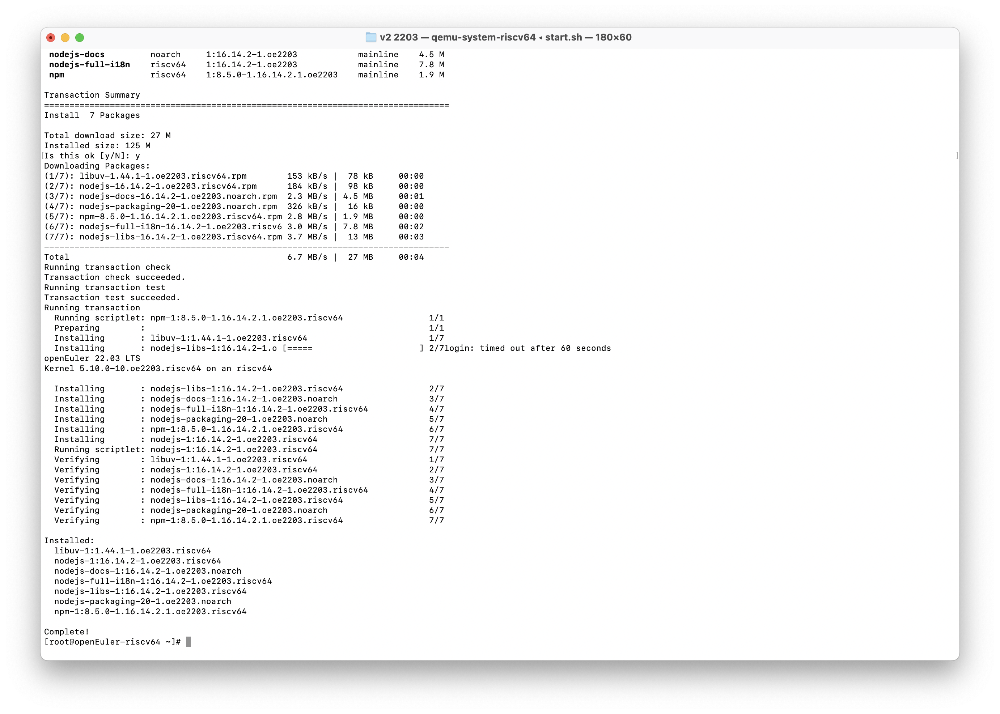
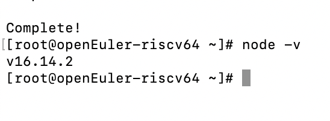
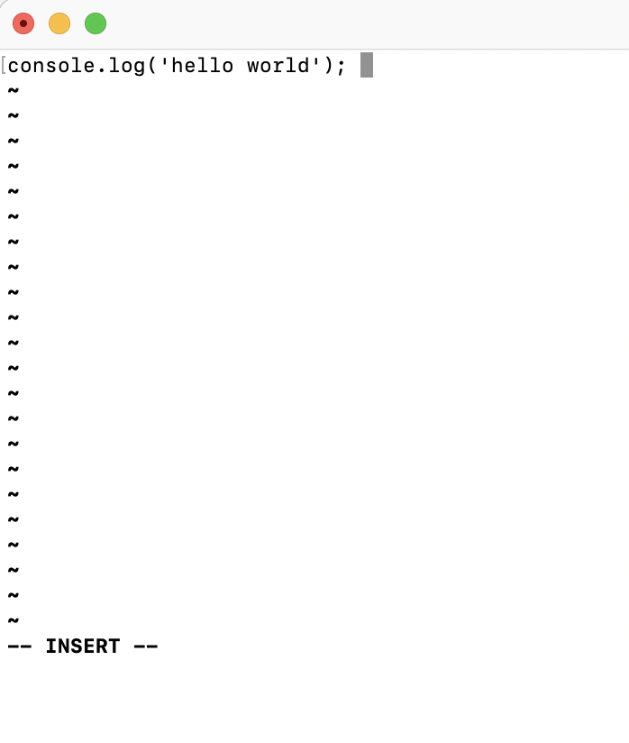
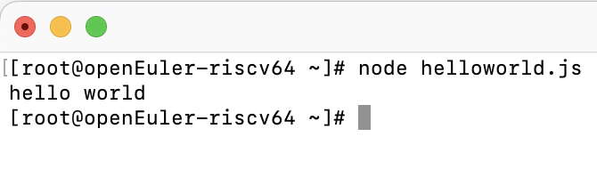

# Report_nodejs

## 摘要

验证是否能够直接安装 nodejs，验证是否安装成功，验证能否使用。

>  使用镜像：openEuler-22.03-V2-xfce-qemu-preview.qcow2

## 安装

输入以下指令安装：

```
dnf install nodejs
```



如上图所示能够直接安装。

## 验证安装是否成功

通过查询 nodejs 版本来验证是否安装成功。



如上图所示正常输出 nodejs 版本，说明安装成功。

## 能否正常使用

创建一个新的 helloworld.js 文件，输入以下代码：

```
console.log('hello world'); 
```



运行该文件，得到下图结果：



## 结论

能够直接安装 nodejs，并且安装成功， 并且能够正常使用。
